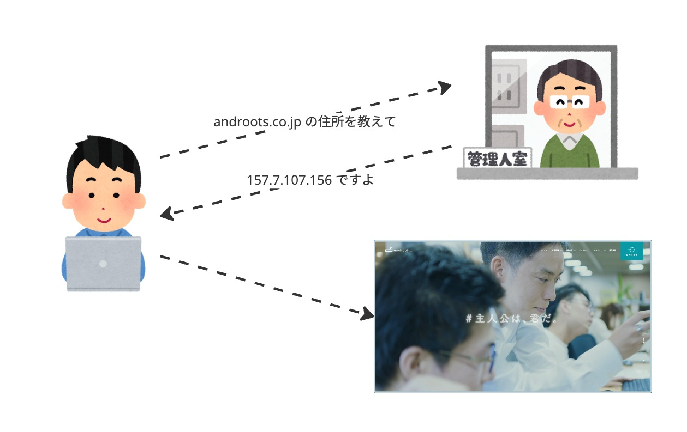

## ドメインとは

---
transition: slide-up
---

### インターネット上の住所

---
transition: slide-up
---

https://androots.co.jp
 
https://google.com/search?q=androots
 
https://youtube.com/watch?v=androots

---
transition: slide-left
---

## ドメインの歴史

<!-- スライド「ドメインの歴史」では、初期の一元管理からDNS誕生までの流れを簡潔に説明します。 -->

---
transition: slide-up
---

### インターネットの仕組み

IP アドレスと呼ばれる数字で通信している

---
transition: slide-up
---

### インターネット初期

通信相手 IP アドレスをの宛先に指定してやり取りしていた
 
相手の IP アドレスを全て覚えなければならない

---
transition: slide-up
---

    <h2>
      相手の住所を覚えられない
    </h2>

---
transition: slide-up
---

### 1 箇所で名前と住所を管理

    <table className="max-w-[500px] max-auto">
      <thead>
        <tr>
          <th>名前</th>
          <th>住所</th>
        </tr>
      </thead>
      <tbody>
        <tr>
          <td>androots.co.jp</td>
          <td>157.7.107.156</td>
        </tr>
        <tr>
          <td>youtube.com</td>
          <td>172.217.161.46</td>
        </tr>
        <tr>
          <td>google.com</td>
          <td>142.250.207.14</td>
        </tr>
      </tbody>
    </table>

---
transition: slide-up
---

    <h2>
      住所を知らなくても通信できる
    </h2>

