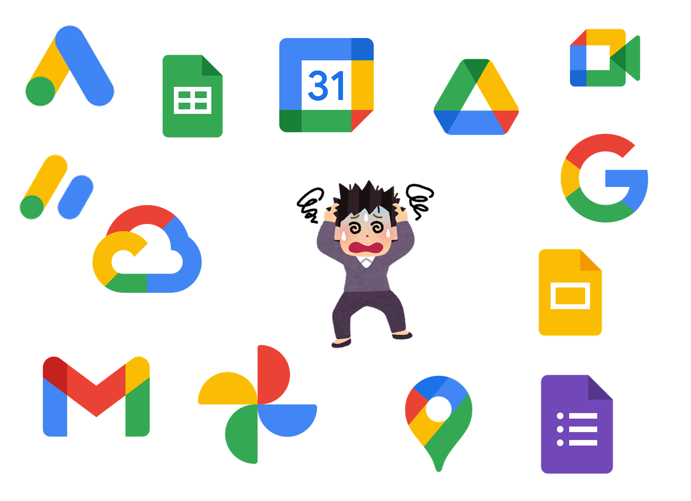

**`google.com` を失う**

---
transition: slide-up
---

2015 年に `google.com` ドメインが一般人によって購入される

---
transition: slide-up
---

すぐに買い戻されたが、もし買い戻されなかったら...

---
transition: slide-up
---

    <h2>
      Google のサービスがほぼ全て使えなくなる
    </h2>

