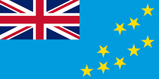
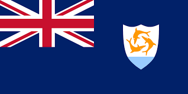

### ドメインが国を救う

---
transition: slide-up
---

### 国ごとにドメインが割り当てられている

- 日本 -> .jp
- アメリカ -> .us
- イギリス -> .uk

---
transition: slide-up
---

**人工約 1 万人の島国であるツバルのドメインは `.tv`**

---
transition: slide-up
---

dotTV 社が `.tv` を登録する権利を 7 億 5300 万円で買い取った

---
transition: slide-up
---

ツバルの GDP の約 57 % が `.tv` からの収入となり、
 
その利益で国際連盟に加盟を果たす

---
transition: slide-up
---

**カリブ海の小さな島、アンギラのドメインは `.ai`**

---
transition: slide-up
---

AI 関連のサービスがこぞって `.ai` ドメインを購入

---
transition: slide-up
---

16000 人の小さな島が年間約 46 億円の利益を得る(2023 年時点)
 
さらに増える見込み...
