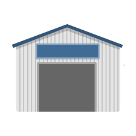
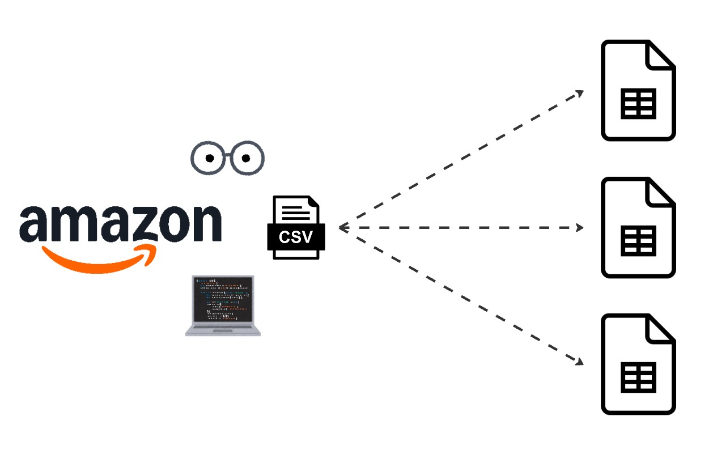
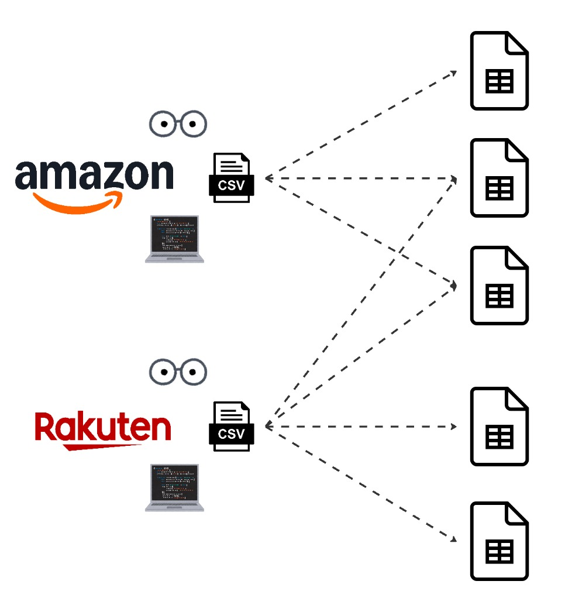
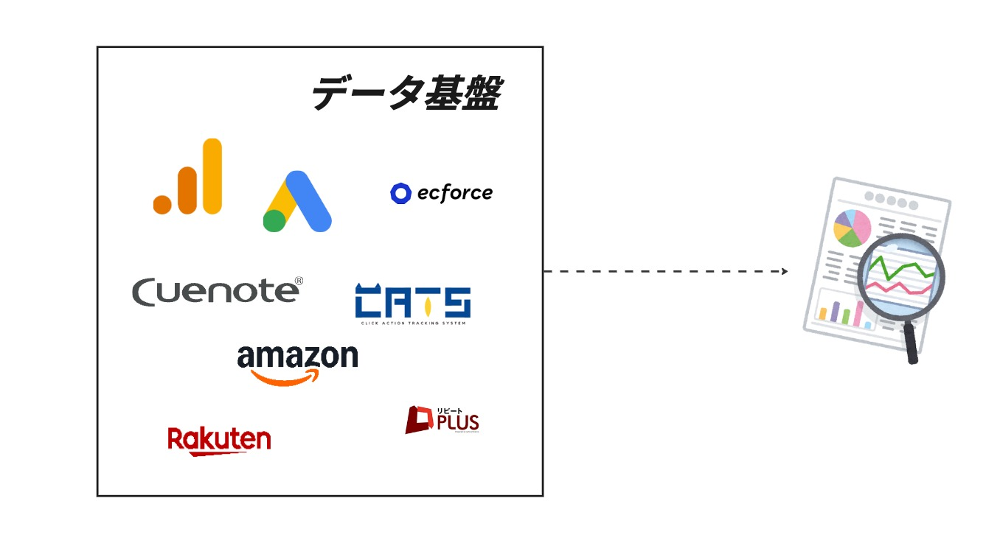

データの基盤とは
### データを集めて、整理している場所

---
transition: slide-up
---

### 図書館や倉庫のようなもの

    
    

---
transition: slide-up
---

## データ基盤がなければ

---
transition: slide-up
---

---
transition: slide-up
---

---
transition: slide-up
---

---
transition: slide-up
---

<h2>データを準備するだけで 1 日が終わる</h2>

---
transition: slide-up
---

## データ基盤があれば

---
transition: slide-left
---

<h2>データを準備せずに、使える</h2>

