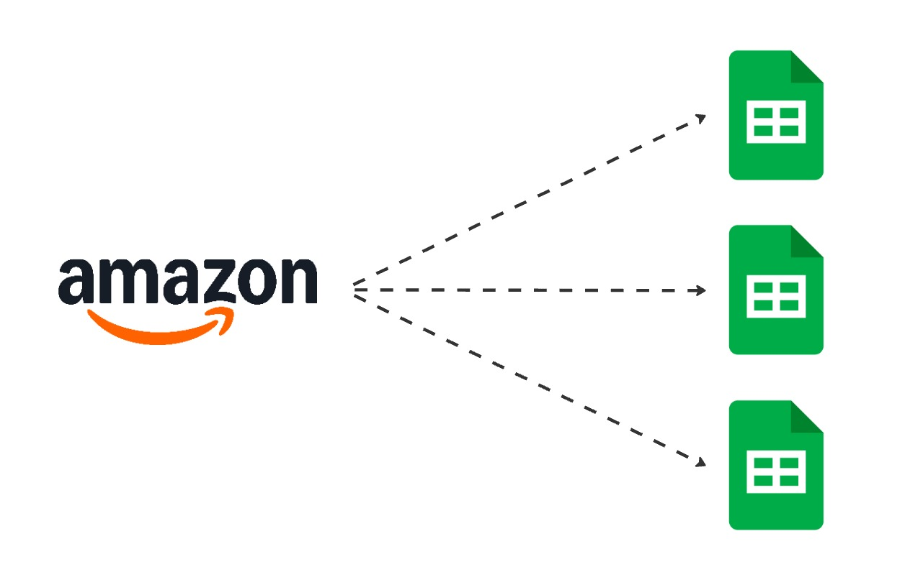
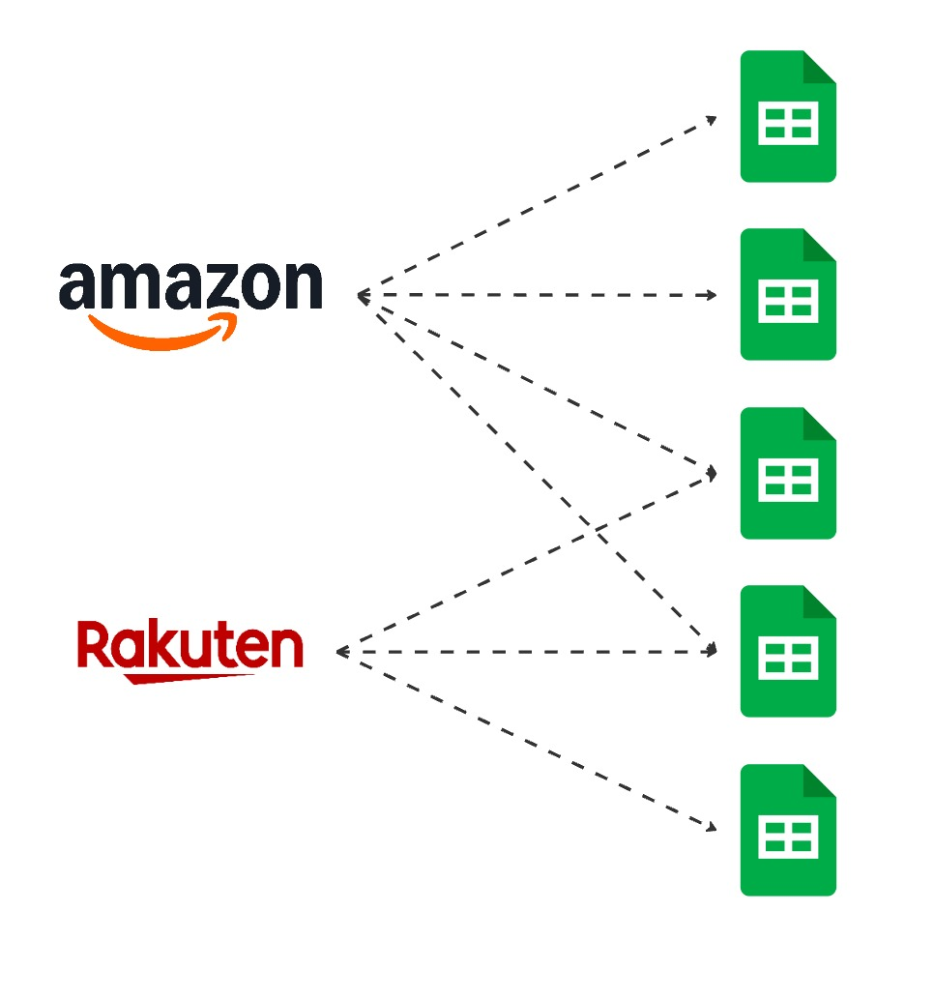

データの基盤とは
### データを 1 か所に集めた倉庫のようなもの

---
transition: slide-left
---

## データ基盤がなければ

---
transition: slide-left
---

---
transition: slide-left
---

---
transition: slide-left
---

---
transition: slide-left
---

<h2>データを準備するだけで 1 日が終わる</h2>

---
transition: slide-left
---

## データ基盤があれば

---
transition: slide-left
---

<h2>データを準備せずに、使える</h2>

