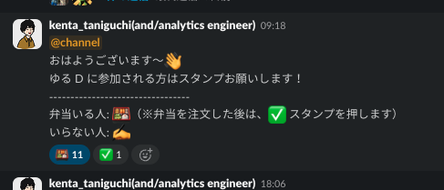

ゆるふわデータサイエンス（通称：ゆる D）

火曜日 19:00 ~ 21:00

---
transition: slide-up
---

  データ分析の勉強をゆるーくするコミュニティ

---
transition: slide-up
---

#### `#s_yuru_d` でスタンプを押すだけ

---
transition: slide-left
---

    

        

          ライトニングトーク
        

    

    

      
2025/02/25 (Tue) 18:30~

    

