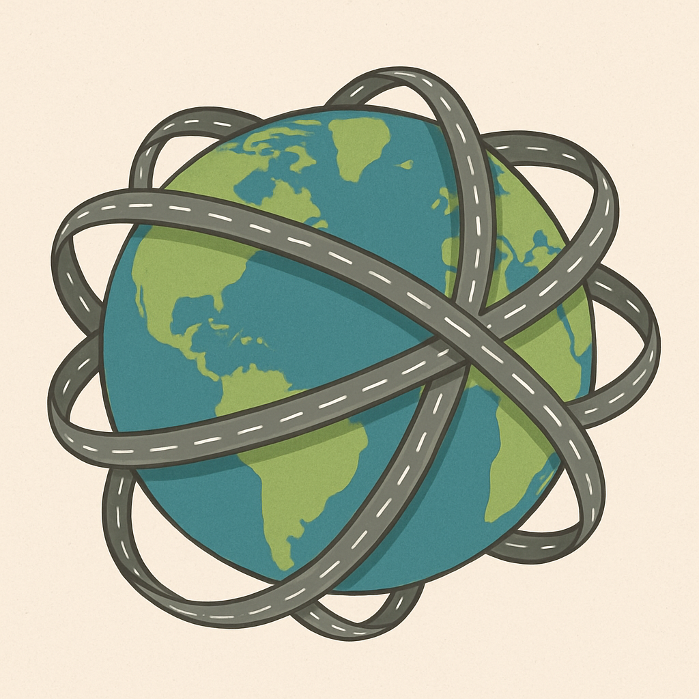
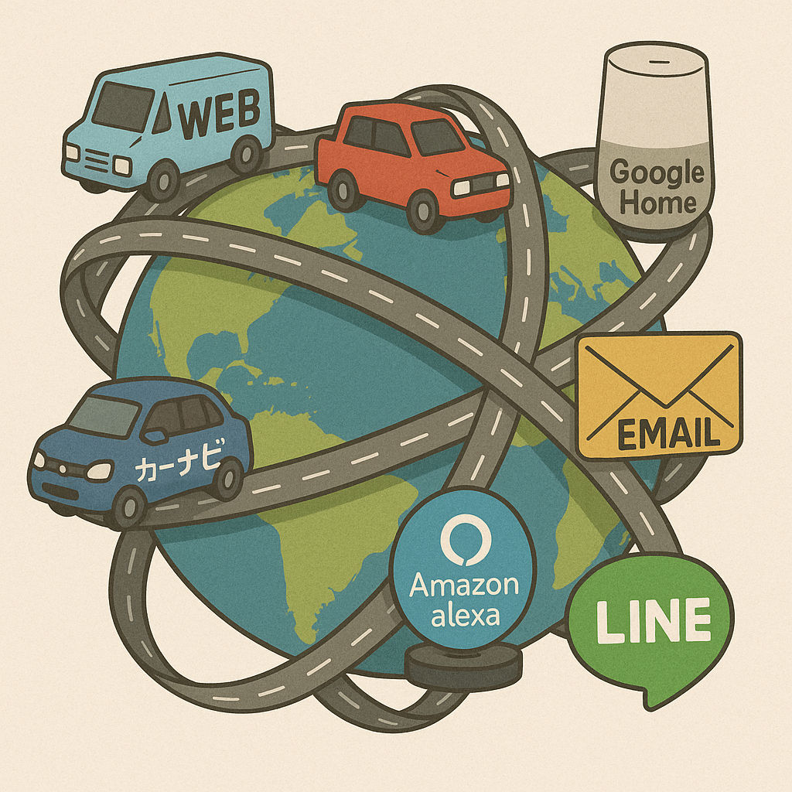
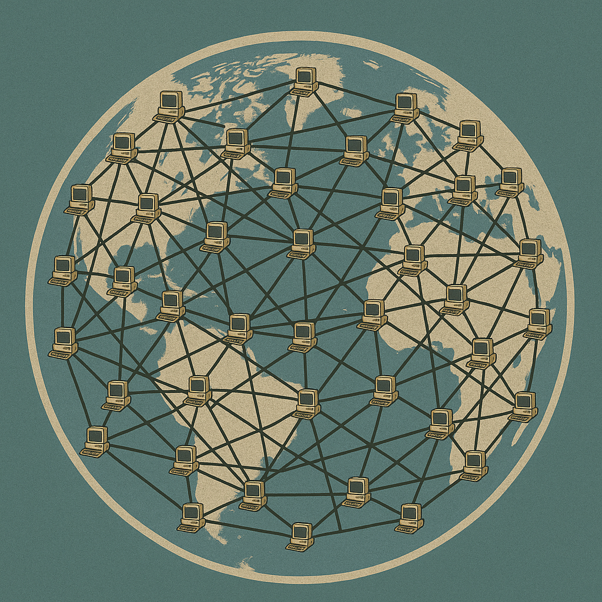
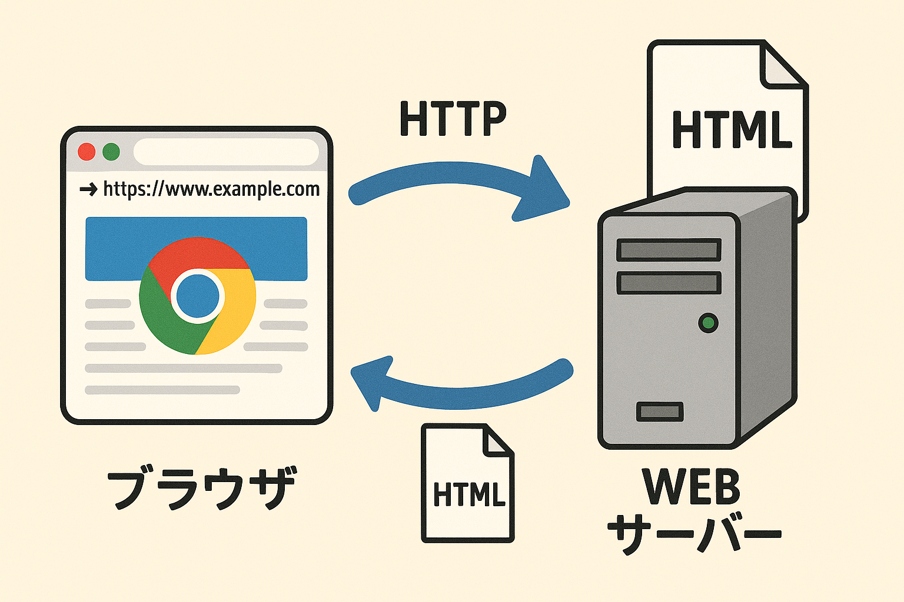
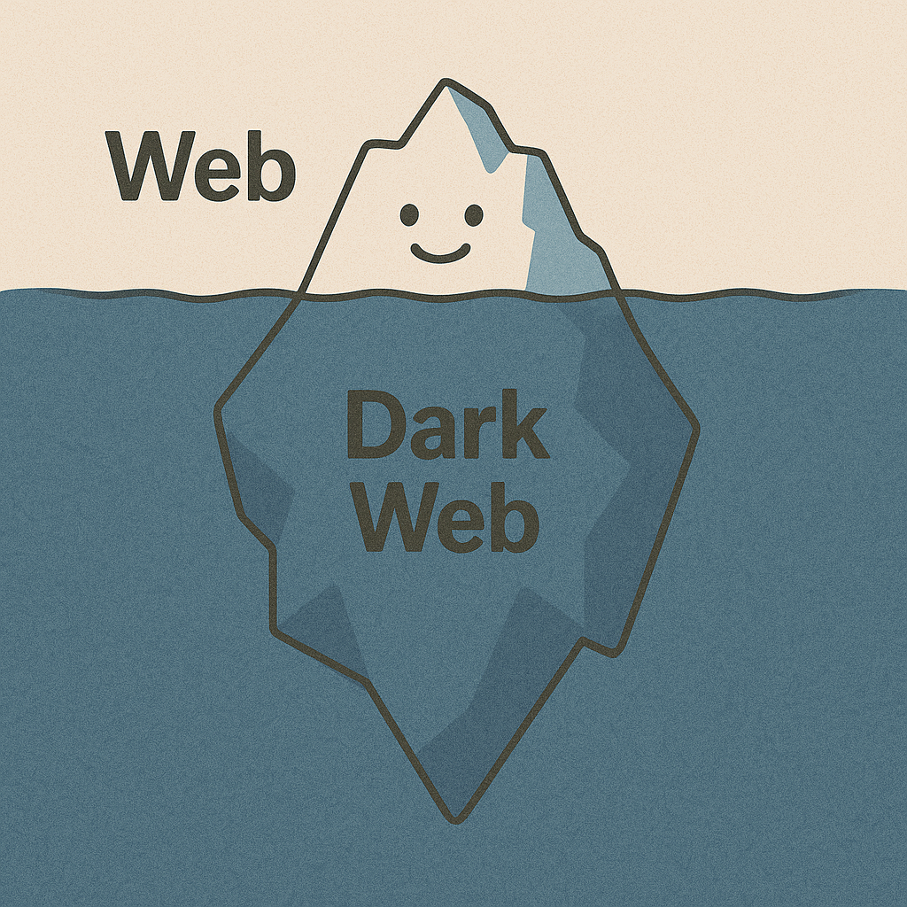

<div class="text-right">
<h2>あなたの知らない Web の世界</h2>
<div class="flex items-center justify-end">
  
  <div class="font-semibold">のむ</div>
</div>
</div>

---

### 目次

1. Webって何？
2. Web の歴史
3. Webを支える技術

---

## 1. Webって何？

---


<div v-click className="absolute bg-white/80 top-0 left-0 w-full h-full flex items-center justify-center transition-all duration-300">
    <h2>
      ブラウザで見ているもの全て
    </h2>
</div>

---

Web は
<br/>
**世界中の情報をつなぐ仕組み**

---

正式名称は
<br/>
**World Wide Web**

---

直訳すると
<br/>
**世界中に張り巡らされた蜘蛛の巣**

---

### インターネットと何が違う？

---

**コンピューター同士をつなぐ巨大なネットワーク**

---


<div v-click className="absolute bg-white/80 top-0 left-0 w-full h-full flex items-center justify-center transition-all duration-300">
  <h4>
    情報が行き交うための道路や線路のようなもの
  </h4>
</div>

---


<div v-click className="absolute bg-white/80 top-0 left-0 w-full h-full flex items-center justify-center transition-all duration-300">
  <h4>
    インターネット上ではいろんなサービスが動いている
  </h4>
</div>

---

### Web は、インターネット上で動く一つのサービス

---

## 3. Web の歴史

---

### インターネットの誕生

---


<div v-click className="absolute bg-white/80 top-0 left-0 w-full h-full flex items-center justify-center transition-all duration-300">
    <h2>
      元々、コンピューターは孤立していた
    </h2>
</div>

---

<div class="text-right">
<b>インターネットの原型となる ARPANET が誕生</b>
<br/>
(1969年)
</div>

---


<div v-click className="absolute bg-white/80 top-0 left-0 w-full h-full flex items-center justify-center transition-all duration-300">
    <h2>
      コンピューター同士がつながった
    </h2>
</div>

---

**どんどんコンピューターが増えて、インターネットが大きくなった**

---


<div v-click className="absolute bg-white/80 top-0 left-0 w-full h-full flex items-center justify-center transition-all duration-300">
  <h3>
    海底ケーブルで大陸を繋ぐ
  </h3>
</div>

---


<div v-click className="absolute bg-white/80 top-0 left-0 w-full h-full flex items-center justify-center transition-all duration-300">
  <h3>
    世界中の人と繋がれるようになった
  </h3>
</div>

---

### Web の誕生

---

#### 🚨 Web 以前の問題点

---

**情報はあるけど見つからない**

---

🎯 例: 「人工知能の最新研究について調べたい」

---

1. 📚 大学図書館でコンピューター雑誌を調べる
   <br/>
   → 「○○大学の△△教授が有名」という情報発見

---

2. ☎️ ○○大学に電話
   <br/>
   → 「学会出張中です、来週お戻りです」

---

3. ☎️ △△教授と連絡成功
   <br/>
   → 「××研究所の◇◇さんに聞いてください」

---

4. ☎️ ××研究所に電話
   <br/>
   → 「論文リストを郵送します」

---

5. 📮 資料到着・確認
   <br/>
   → さらに詳しい情報が必要なら、また人探し...

---

**情報を探すのにめちゃくちゃ時間がかかる**

---

<div class="mb-10">

<div class="italic text-center text-xl">— Tim Berners-Lee</div>
</div>

> **クリック一つで関連情報に飛べるシステムを作ろう！**

---

### 🌐 World Wide Web が誕生

---

### 🌐 1991 年に最初の Web サイトが誕生

<a href="http://info.cern.ch/hypertext/WWW/TheProject.html" target="_blank">http://info.cern.ch/hypertext/WWW/TheProject.html</a>

---


<div v-click className="absolute bg-white/80 top-0 left-0 w-full h-full flex items-center justify-center transition-all duration-300">
    <h4>
      URL さえ知っていれば、情報にアクセスできる
    </h4>
</div>

---

### 🎯 Web の革命的な特徴

- クリックで関連ページに移動
- ブラウザ一つで全てのサイトにアクセス
- 専門知識不要 ( URL を知っていればだれでも情報を見れる )

---


<div v-click className="absolute bg-white/80 top-0 left-0 w-full h-full flex items-center justify-center transition-all duration-300">
    <h2>
      検索エンジンの登場
    </h2>
</div>

---


<div v-click className="absolute bg-white/80 top-0 left-0 w-full h-full flex items-center justify-center transition-all duration-300">
    <h2>
      スマホの登場
    </h2>
</div>

---


<div v-click className="absolute bg-white/80 top-0 left-0 w-full h-full flex items-center justify-center transition-all duration-300">
    <h3>
      Web サイトが爆発的に増加
    </h3>
</div>

---

### 💡 Webがもたらした変化

- 情報アクセス: 図書館 → 検索エンジン
- コミュニケーション: 手紙 → メール・SNS
- ビジネス: 店舗 → Eコマース
- 学習: 教室 → オンライン教育
- エンターテイメント: テレビ → 動画配信

---

## 4. Webを支える技術

---

**URL**
<br/>
**HTML**
<br/>
**HTTP**

---

### URL

**Web 上の住所のようなもの**
<br/>

**例：https://www.androots.co.jp**

---

### HTML

**Web ページを作成するためのファイル形式**

---

```html
<html>
  <head>
    <title>and roots</title>
  </head>
  <body>
    <h1>会社情報</h1>
    <h1>ビジョン</h1>
  </body>
</html>
```

---

### HTTP

**Web 上の情報をやり取りするためのルール**

---



<div v-click className="absolute bg-white/80 top-0 left-0 w-full h-full flex items-center justify-center transition-all duration-300">
  <h3>
    3つの技術の連携
  </h3>
</div>

---

1. **URL**で「どこの情報が欲しいか」を指定

   - 例：`https://www.androots.co.jp`

2. **HTTP**で「その情報をください」とお願い
3. **HTML**で情報が返ってくる
4. **ブラウザ**がHTMLを読んで画面に表示

---

### まとめ

- **Web** はインターネット上で世界中の情報を繋ぐ仕組み
- **URL, HTML, HTTP** で動いている
- **ブラウザが Web サーバーと連携して、Web ページを表示している**

---


<div v-click className="absolute bg-white/80 top-0 left-0 w-full h-full flex items-center justify-center transition-all duration-300">
  <div class="text-right">
    <h4>次回: あなたの知らないダークウェブの世界</h4>
    〜インターネットの裏側〜
  </div>
</div>

---

### ご清聴ありがとうございました
